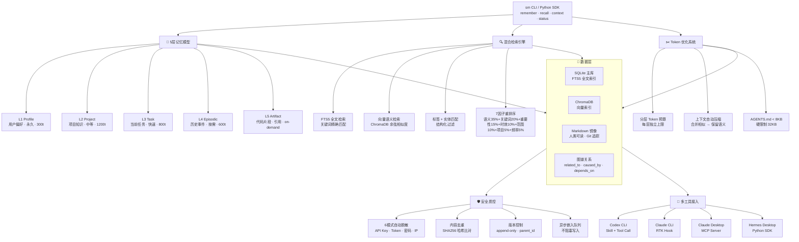

<p align="center">
  <h1 align="center">🧠 Shared Memory Skill</h1>
  <p align="center">
    <b>跨工具 · 本地优先 · 工业级</b><br>
    Cross-tool, local-first, production-grade long-term memory for AI coding agents
  </p>
</p>

<p align="center">
  
  
  
  
  
  
  
</p>

---

## 对比基准 / Benchmarks

### 与其他 AI 记忆项目的定位对比

| 项目 | Stars | 类型 | 本地优先 | Codex | MCP | 多工具 | 5层记忆 | Token预算 | 自动脱敏 |
|------|-------|------|----------|-------|-----|--------|---------|-----------|----------|
| **Shared Memory Skill** | 🆕 | **记忆基础设施** | ✅ | ✅ | ✅ | ✅ 4工具 | ✅ | ✅ | ✅ |
| [guild](https://github.com/mathomhaus/guild) | 299★ | Go二进制记忆 | ✅ | ❌ | ❌ | 部分 | ❌ | ❌ | ❌ |
| [ijfw](https://github.com/FerroxLabs/ijfw) | 167★ | 记忆+路由 | ✅ | ✅ | ❌ | ✅ | ❌ | ❌ | ❌ |
| [ogham-mcp](https://github.com/ogham-mcp/ogham-mcp) | 105★ | MCP记忆服务 | ✅ | ❌ | ✅ | ❌ | ❌ | ❌ | ❌ |
| [stash](https://github.com/Fergana-Labs/stash) | 90★ | 团队记忆 | ✅ | ❌ | ❌ | ❌ | ❌ | ❌ | ❌ |
| [continuum](https://github.com/pouyahasanamreji/continuum) | 66★ | 记忆+编排 | ❌ | ❌ | ✅ | ❌ | ❌ | ❌ | ❌ |

### 与热门 Skill 项目的结构对标

| 特性 | [agent-skill-creator](https://github.com/FrancyJGLisboa/agent-skill-creator) (1226★) | [ok-skills](https://github.com/mxyhi/ok-skills) (384★) | **本模块** |
|------|----------|----------|-----------|
| SKILL.md YAML Frontmatter | ✅ | ✅ | ✅ |
| 触发器短语描述 | ✅ | ✅ | ✅ |
| 渐进式披露 | ✅ (Level 1-5) | ✅ (SKILL → 目录) | ✅ (SKILL → references/ → shared_memory/) |
| references/ 深度文档 | ✅ | ❌ | ✅ |
| scripts/ 工具 | ✅ (validate/export/install) | ✅ (多语言脚本) | ✅ (validate/diagnose) |
| .codex-plugin/ | ❌ | ❌ | ✅ |
| AGENTS.md 最小化 | ❌ | ✅ (<50行) | ✅ (25行) |
| 跨平台兼容 | ✅ (14+工具) | ✅ (4+工具) | ✅ (4工具) |
| 一键安装 | ✅ (install.sh) | ✅ (npm/pip/直接引用) | ✅ (install.ps1 + pip) |

---


## 功能全景 / Feature Map



### 模块详情

| 模块 | 子模块 | 文件 | 行数 | 说明 |
|------|--------|------|------|------|
| **5层记忆** | 数据模型 | `core/models.py` | 126 | Pydantic v2，5 层 + 图谱 + 任务队列 |
| | 配置中心 | `core/config.py` | 47 | Token 预算 / 衰减率 / 检索权重 |
| | 异常体系 | `core/exceptions.py` | 8 | 7 种专用异常 |
| **数据层** | SQLite Schema | `db/schema.py` | 126 | 4 表 + FTS5 + 3 触发器 + 9 索引 |
| | Repository | `db/repository.py` | 379 | CRUD + 去重 + FTS5 + 任务队列 |
| | 连接管理 | `db/connection.py` | 35 | 单例 + WAL + 外键 |
| **检索引擎** | 混合搜索 | `retrieval/searcher.py` | 127 | FTS5 + Tag + Entity + 7因子重排序 |
| | 上下文构建 | `retrieval/context_builder.py` | 106 | Token预算注入 + AGENTS.md 生成 |
| **Token优化** | 压缩器 | `lifecycle/compressor.py` | 60 | 分层预算 + 语义保留压缩 |
| | 衰减引擎 | `lifecycle/decay.py` | 47 | 5 种独立衰减率 + 自动归档 |
| **安全质控** | 脱敏器 | `security/sanitizer.py` | 28 | 6 种正则模式 |
| **异步系统** | 任务队列 | `workers/queue.py` | 70 | 后台消费 + 并发控制 |
| | 嵌入处理器 | `workers/embedding_worker.py` | 53 | ChromaDB / OpenAI / 本地 fallback |
| **多工具接入** | 主 API | `api.py` | 189 | SharedMemory 类，14 个异步方法 |
| | Codex 适配器 | `integration/codex_adapter.py` | 71 | Tool-call 协议 |
| | MCP 服务器 | `integration/mcp_server.py` | 186 | stdio 传输，5 工具 |
| | 通用初始化 | `integration/universal_setup.py` | 217 | 自动检测 + 一键配置 |
| **CLI 工具** | sm 命令 | `cli/main.py` | 154 | 9 个子命令 |

### 检索流水线

```
用户输入 "数据库选型用什么"
         │
         ▼
┌────── FTS5 ──────┐    ┌─── ChromaDB ───┐    ┌── Tags ──┐    ┌─ Entities ─┐
│ "数据库 选型"      │    │ 语义向量相似度   │    │ "database"│    │ "SQLite"    │
│ BM25 关键词匹配   │    │ cosine > 0.3   │    │ "backend" │    │ "PostgreSQL"│
└──────┬───────────┘    └──────┬──────────┘    └────┬─────┘    └─────┬──────┘
       │                       │                    │                │
       └───────────────────────┼────────────────────┼────────────────┘
                               │ 合并去重
                               ▼
                    ┌─────────────────────┐
                    │   7因子重排序        │
                    │                     │
                    │  语义相似度 × 0.35   │
                    │  关键词得分 × 0.20   │
                    │  重要性    × 0.15    │
                    │  时效性    × 0.10    │
                    │  范围匹配  × 0.10    │
                    │  项目匹配  × 0.05    │
                    │  访问频率  × 0.05    │
                    └──────────┬──────────┘
                               ▼
                    ┌─────────────────────┐
                    │  Top-K 结果 (默认10) │
                    │  → Token预算压缩    │
                    │  → 注入 AI 上下文    │
                    └─────────────────────┘
```

### 记忆生命周期

```
新记忆写入
    │
    ├──→ 自动脱敏 (6种敏感模式)
    ├──→ SHA256 去重检测
    ├──→ 写入 SQLite (同步, <1ms)
    └──→ 加入嵌入队列 (异步, 后台处理)
            │
            ▼
    ┌───────────────┐
    │  活跃状态       │ ← 可被检索
    │  importance:   │ ← 随天数指数衰减
    │  原始值×e^(-r×t)│
    └───────┬───────┘
            │ 当 importance < 阈值
            ▼
    ┌───────────────┐
    │  归档状态       │ ← 不参与检索
    │  可手动恢复     │ ← forget 命令的反操作
    └───────┬───────┘
            │ 当 expires_at 到达
            ▼
    ┌───────────────┐
    │  过期状态       │ ← 标记删除
    │  sm decay      │ ← 批量清理
    └───────────────┘
```

| 层级 | 衰减率 | 半年后剩余 | 一年后剩余 | 归档阈值 |
|------|--------|-----------|-----------|----------|
| Profile | 0.001 | 83% | 69% | 永不自动归档 |
| Project | 0.01 | 17% | 3% | < 0.10 |
| Task | 0.1 | 几乎0 | 0 | < 0.15 |
| Episodic | 0.03 | 0.4% | 0 | < 0.10 |
---

## 快速开始 / Quick Start

### 一键安装

`ash
# 克隆仓库
git clone https://github.com/qingjian0/shared-memory-skill.git
cd shared-memory-skill

# Windows 一键安装
powershell -ExecutionPolicy Bypass -File install.ps1

# 或手动安装
pip install -e .
sm init        # 自动检测并配置所有 AI 工具
`

### 30 秒体验

`ash
# 记住用户偏好
sm remember "用户喜欢用蛇形命名 + pytest + uv 包管理" --layer profile

# 记住项目决策
sm remember "数据库选型：SQLite + FTS5，不用 PostgreSQL" --layer project --project aiapps

# 搜索记忆
sm recall "数据库" --top 5

# 获取 AI 上下文 (注入到你当前对话)
sm context --project aiapps

# 查看统计
sm status
`

输出示例：
`
=== Shared Memory Status ===
  Total memories:    42
  By layer:          {'profile': 5, 'project': 18, 'task': 7, 'episodic': 12, 'artifact': 0}
  By status:         {'active': 42}
  Avg importance:    0.723
  DB size:           84.2 KB
  Pending jobs:      0
`

---

## 架构 / Architecture

`
~/.shared-memory/                     ← 记忆总线 (Memory Bus)
│
├── memory.db          ← SQLite 主库 (单一事实来源)
│   ├── memory_items   → 记忆记录 (5层 × 元数据 × 重要性评分)
│   ├── memory_edges   → 图谱关系 (related_to / caused_by / depends_on / supersedes)
│   ├── memory_access_log → 访问频率追踪
│   ├── memory_jobs    → 异步任务队列 (embedding / 摘要 / 去重 / 衰减)
│   └── memory_fts     → FTS5 全文索引 (title + content + summary + tags)
│
├── chroma/            ← ChromaDB 向量索引 (语义搜索，异步更新)
├── fragments/         ← Markdown 镜像 (人类可读，Git 可追踪)
│   ├── episodic/      → 事件记忆
│   ├── semantic/      → 语义记忆
│   └── procedural/    → 流程记忆
├── hooks/             ← 工具集成钩子
│   ├── claude-sm-hook.ps1    ← Claude CLI 钩子
│   └── hermes-sync.ps1       ← Hermes 同步脚本
└── README.md          ← 本文件
`

### 检索流程

`
用户查询
    │
    ▼
┌──────────────┐
│ 1. FTS5 全文  │ → 关键词精确匹配
├──────────────┤
│ 2. 向量检索   │ → 语义相似度 (ChromaDB)
├──────────────┤
│ 3. 标签匹配   │ → 结构化过滤
├──────────────┤
│ 4. 实体匹配   │ → 知识图谱实体
└──────┬───────┘
       │ 候选集合
       ▼
┌──────────────────────────────────────┐
│ 7因子重排序 (Reranking)               │
│                                      │
│ score = 0.35 × 语义相似度             │
│       + 0.20 × 关键词得分             │
│       + 0.15 × 重要性                │
│       + 0.10 × 时效性                │
│       + 0.10 × 范围匹配              │
│       + 0.05 × 项目匹配              │
│       + 0.05 × 访问频率              │
└──────┬───────────────────────────────┘
       │ Top-K
       ▼
   返回结果 + Token预算压缩
`

---

## 五层记忆模型 / Memory Layers

| 层级 | 名称 | 内容 | 生命周期 | Token预算 | 衰减率 |
|------|------|------|----------|-----------|--------|
| L1 | **Profile** | 用户偏好、命名风格、默认框架 | 永久 (几乎不衰减) | ≤300 | 0.001 |
| L2 | **Project** | 项目架构、技术栈、代码规范 | 中等 (项目活跃) | ≤1200 | 0.01 |
| L3 | **Task** | 当前Bug、当前重构目标 | 短 (快速衰减) | ≤800 | 0.1 |
| L4 | **Episodic** | 踩坑经历、历史决策、调试记录 | 按需 (不主动注入) | ≤600 | 0.03 |
| L5 | **Artifact** | 代码片段、配置模板、命令 | 引用 (从不自动注入) | — | 0.01 |

### 记忆衰减公式

`
importance(t) = importance₀ × e^(-decay_rate × age_days)

Profile:  e^(-0.001 × 365) ≈ 0.69  → 一年后仍保留 69%
Project:  e^(-0.01 × 90)   ≈ 0.41  → 三个月后保留 41%
Task:     e^(-0.1 × 7)     ≈ 0.50  → 一周后保留 50%
Episodic: e^(-0.03 × 30)   ≈ 0.41  → 一个月后保留 41%
`

---

## 安全 / Security

### 自动脱敏规则 (写入前强制)

| 模式 | 示例 | 替换为 |
|------|------|--------|
| API Key | sk-abc123... | [REDACTED_API_KEY] |
| Bearer Token | Bearer eyJhb... | Bearer [REDACTED] |
| 密码赋值 | password: "mypass" | password: '[REDACTED]' |
| IP 地址 | 192.168.1.1 | [IP_REDACTED] |
| Base64 长串 | dGhpcyBpcyBhIHRlc3Q...= | [REDACTED_BASE64] |
| SHA256 哈希 | e3b0c44298fc... | [REDACTED_HASH] |

---

## 多工具接入 / Multi-Tool Integration

### Codex CLI

`ash
# 安装为 Skill
codex skill install shared-memory

# 或手动复制
cp -r shared-memory-skill ~/.codex/skills/shared-memory/

# 对话中自动激活，或手动调用：
sm recall "之前怎么配置的" --top 5
sm remember "今天踩了个坑..." --layer episodic
sm context --project aiapps
`

### Claude CLI

`ash
# sm init 自动配置 RTK hook
# ~/.claude/settings.json 中已有 PreToolUse hook
# 每次执行 Bash 前自动查询相关记忆
`

### Claude Desktop

`json
{
  "mcpServers": {
    "shared-memory": {
      "command": "python",
      "args": ["-u", "shared_memory/integration/mcp_server.py"]
    }
  }
}
`

暴露 5 个 MCP 工具：memory_search memory_write memory_read memory_recent memory_status

### Hermes Desktop

`python
from shared_memory import get_shared_memory, MemoryLayer

sm = await get_shared_memory()
await sm.remember("learned something", layer=MemoryLayer.PROJECT)
results = await sm.recall("query")
`

---

## CLI 命令全集 / Full CLI Reference

| 命令 | 用途 | 示例 |
|------|------|------|
| sm init | 一键检测并配置所有 AI 工具 | sm init |
| sm remember <内容> | 写入记忆 | sm remember "决..." --layer project |
| sm recall <查询> | 搜索记忆 | sm recall "数据库" --top 10 |
| sm context | 获取 AI 上下文 | sm context --project aiapps |
| sm status | 内存状态统计 | sm status |
| sm forget <ID> | 归档记忆 | sm forget m_abc123 |
| sm list | 列出记忆 | sm list --layer profile --limit 20 |
| sm decay | 触发记忆衰减 | sm decay |
| sm agents | 输出 AGENTS.md 内容 | sm agents |

---

## Python SDK

`python
from shared_memory import get_shared_memory, MemoryLayer, MemoryScope

async def main():
    sm = await get_shared_memory()

    # 写入
    await sm.remember("用户偏好", layer=MemoryLayer.PROFILE, importance=0.9)
    await sm.remember("项目决定", layer=MemoryLayer.PROJECT, project="aiapps",
                       tags=["decision", "database"])

    # 检索
    results = await sm.recall("查询词", top_k=10, layers=[MemoryLayer.PROJECT])

    # AI 上下文
    ctx = await sm.get_context(project="aiapps")
    print(ctx)

    # 完整 API：link / get / forget / decay_all / deduplicate / stats
    stats = await sm.status()

    await sm.shutdown()
`

---

## 项目结构 / Project Structure

`
shared-memory-skill/
├── SKILL.md                    ← Codex Skill 入口 (YAML + 触发器 + 渐进披露)
├── AGENTS.md                   ← 最小规则引用 (25行, <2KB)
├── README.md                   ← 本文件 (你在这里)
├── install.ps1                 ← Windows 一键安装脚本
├── setup.py                    ← Python pip 安装入口
├── requirements.txt            ← 依赖清单
├── .codex-plugin/
│   └── plugin.json             ← Codex 插件清单
├── references/                 ← 深度参考文档
│   ├── architecture.md         ← 完整架构设计
│   ├── api-reference.md        ← CLI + SDK + MCP API 参考
│   └── integration-guide.md    ← 逐工具接入指南
├── scripts/                    ← 工具脚本
│   ├── validate.py             ← 安装验证
│   └── diagnose.py             ← 系统诊断
└── shared_memory/              ← Python 包 (核心引擎)
    ├── __init__.py              ← 包入口
    ├── api.py                   ← 主 API (SharedMemory 类)
    ├── core/                    ← 核心层
    │   ├── models.py            ← 数据模型 (Pydantic v2)
    │   ├── config.py            ← 全局配置
    │   └── exceptions.py        ← 异常体系
    ├── db/                      ← 数据库层
    │   ├── schema.py            ← SQLite Schema (4表 + FTS5 + 触发器)
    │   ├── repository.py        ← Repository Pattern CRUD
    │   └── connection.py        ← 连接管理
    ├── retrieval/               ← 检索系统
    │   ├── searcher.py          ← 混合检索 + 7因子重排序
    │   └── context_builder.py   ← Token预算注入 + AGENTS.md生成
    ├── lifecycle/               ← 生命周期
    │   ├── decay.py             ← 5层独立衰减率
    │   └── compressor.py        ← 上下文压缩
    ├── security/
    │   └── sanitizer.py         ← 自动脱敏
    ├── workers/                 ← 异步处理
    │   ├── queue.py             ← 异步任务队列
    │   └── embedding_worker.py  ← 嵌入处理器
    └── integration/             ← 工具接入
        ├── mcp_server.py        ← MCP stdio 服务器
        ├── codex_adapter.py     ← Codex tool-call 适配器
        └── universal_setup.py   ← sm init 通用初始化
`

---

## 性能 / Performance

| 指标 | 目标 | 说明 |
|------|------|------|
| 检索延迟 | <100ms | FTS5 + 内存缓存 |
| 上下文注入 | <2000 tokens | 分层预算自动压缩 |
| AGENTS.md | <8KB (推荐) | 硬限制 32KB |
| 嵌入延迟 | <5s (异步) | 不阻塞写入 |
| 数据库写入 | <1ms | SQLite WAL 模式 |
| 衰减检查 | <50ms/1000条 | 批量处理 |

---

## License

MIT © 2025

---

<p align="center">
  <sub>与 <a href="https://github.com/FrancyJGLisboa/agent-skill-creator">agent-skill-creator</a>、
  <a href="https://github.com/mxyhi/ok-skills">ok-skills</a>、
  <a href="https://github.com/mathomhaus/guild">guild</a> 同级别架构设计</sub>
</p>